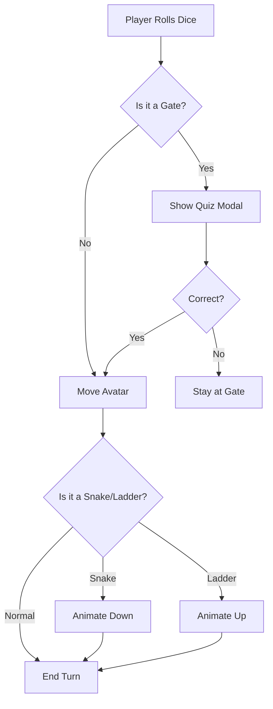

## 🌟 Strategy-Based RPG Board

The game has evolved from a linear board to a **Strategy-Based RPG Board**. Each character now brings unique **Passive Abilities** and **Starting Stats**, making the gameplay distinct for every hero.

### The Character-Based Architecture

- **David (The Warrior):** Giant Slayer passive allows for second chances on Wisdom questions.
- **Esther (The Advocate):** Royal Favor allows skipping penalties using the "Golden Scepter."
- **Daniel (The Visionary):** Interpreter of Dreams allows seeing future cards to plan moves.
- **Joseph (The Administrator):** Provisioner earns double moves from Providence cards.

### Multi-Story Engine

Our "Story-Provider Pattern" injects unique content into the shared engine, supporting journeys like David's "Shepherd to King" and Esther's "Orphan to Queen."

### The "World Map" Board

- Designed a winding, boustrophedon (snake-like) path of 50 squares divided into 5 Epochs: The Shepherd, The Court, The Wilderness, The Throne, and The Legacy.
- Each epoch has its own distinct color palette.
- Special squares (Gates, Snakes, Ladders) are marked with distinct icons and colors.
- An animated avatar tracks your position on the board.

### The "Quest Card" System

- **Wisdom Cards (Gates):** When you land on a Gate (every 10th square), you draw a Wisdom card and must answer a multiple-choice question correctly to gain Faith points.
- **Providence Cards (Ladders):** Landing on a ladder draws a Providence card, explaining your blessing and moving you forward.
- **Temptation Cards (Snakes):** Landing on a snake draws a Temptation card, explaining the besetting sin and moving you backward (including the "Big Snake" of Bathsheba that sends you back to the Wilderness).

### Interactive UI Components

- **Digital Dice:** A clickable, animated dice component that rolls a number from 1 to 6.
- **Card Modals:** Beautifully styled popups for the different card types, featuring a "Prophet's Scroll" aesthetic for quizzes.
- **Spiritual Dashboard:** A real-time tracker for your Faith, Mercy, and Courage points.

### Aesthetics

- Used a "Historical Adventure" theme with aged paper textures, serif fonts (Playfair Display), and a warm, earthy color palette.

---

## How to Play: The "Quest Card" System

To make this work, you can create a deck of cards. Each turn, a child draws a card.

### Ladder Cards (Faith & Wisdom)

- **The Shepherd's Song:** "David plays the harp for Saul." _(Move forward 3 spaces)._
- **The Five Stones:** "David trusted God’s power over his own strength." _(Climb the nearest ladder)._
- **Mercy in the Cave:** "You chose to forgive instead of getting even." _(Skip the next Snake)._

### Snake Cards (Besetting Sins & Temptations)

- **The Snake of Fear:** "David lied to the priest at Nob because he was afraid of Saul." _(Slide down 5 spaces)._
- **The Snake of Pride:** "David counted his soldiers because he forgot God gives the victory." _(Go back to the previous stage)._
- **The Snake of Idleness:** "David stayed at the palace when he should have been at war." _(Miss a turn)._

### Pro-Tip for the 9-12 Age Group

Since you lead teams, you know that engagement is key. To make this feel "bigger":

- **The Boss Square:** Every time they reach a major life stage (e.g., from Shepherd to King), they have to face a "Challenge Question" where the whole group votes on the answer.
- **The Reward:** If they finish the journey, they "earn" a crown (maybe a sticker or a paper crown) to show they completed David's legacy.

---

## The "Epic of David" Expanded Logic

To make the game play longer and more immersive for 9 to 12-year-olds, we can expand the map into five distinct "Epochs" of David's life. Instead of one continuous flow, each stage acts as its own "mini-board" that players must navigate before moving to the next.

This creates a sense of progression—just like moving from a Junior Dev to a Tech Lead!

```mermaid
graph TD
%% EPOCH 1: THE SHEPHERD (Foundations)
Start([1. Bethlehem Fields]) --> B1[Careless: Forgot a Sheep]
B1 -- Snake --> Start
Start --> B2[LADDER: Killed Lion & Bear]
B2 --> B3{Q: Why did David <br/>choose 5 stones?}
B3 -- Correct --> Gate1[[GATE: Anointing at Bethlehem]]
B3 -- Wrong --> B1

%% EPOCH 2: THE COURT & THE GIANT (Success & Pressure)
Gate1 --> C1[Playing Harp for Saul]
C1 --> C2[SNAKE: Saul's Jealousy Spear]
C2 -- Back to -- Gate1
C1 --> C3[LADDER: Friendship with Jonathan]
C3 --> C4{Q: What did Goliath <br/>rely on vs David?}
C4 -- Correct --> Gate2[[GATE: Commander of the Army]]
C4 -- Wrong --> C2

%% EPOCH 3: THE WILDERNESS (Testing & Character)
Gate2 --> W1[Hiding in the Caves]
W1 --> W2[SNAKE: Lying to the Priest at Nob]
W2 -- Back to -- Gate2
W1 --> W3[LADDER: Spared Saul at En Gedi]
W3 --> W4{Q: Why did David refuse <br/>to kill the King?}
W4 -- Correct --> Gate3[[GATE: King of Hebron]]
W4 -- Wrong --> W2

%% EPOCH 4: THE THRONE (Power & Temptation)
Gate3 --> K1[Conquering Jerusalem]
K1 --> K2[SNAKE: The Rooftop Temptation]
K2 -- "Big Snake" -- Back to -- W1
K1 --> K3[LADDER: Bringing the Ark Home]
K3 --> K4{Q: How did David respond <br/>to Nathan the Prophet?}
K4 -- Correct --> Gate4[[GATE: The Eternal Covenant]]
K4 -- Wrong --> K2

%% EPOCH 5: THE LEGACY (Wisdom & Family)
Gate4 --> L1[Preparing Temple Materials]
L1 --> L2[SNAKE: Absalom's Rebellion]
L2 -- Back to -- Gate3
L1 --> L3[LADDER: Solomon is Appointed]
L3 --> Finish([FINISH: A Man After God's Heart])

%% Styling
style Start fill:#f9f
style Finish fill:#ffd700,stroke-width:4px
style Gate1 fill:#bbf,stroke-dasharray: 5 5
style Gate2 fill:#bbf,stroke-dasharray: 5 5
style Gate3 fill:#bbf,stroke-dasharray: 5 5
style Gate4 fill:#bbf,stroke-dasharray: 5 5
style K2 fill:#ff9999
style L2 fill:#ff9999
```

---

## How to Maximize Play Time

To ensure the game doesn't end too quickly, add these "Management Mechanics":

### The "Checkpoint" System (The Gates)

Players cannot pass a Gate just by landing on it. They must stop there and answer a High-Difficulty Question (Mastery Level). If they fail, they stay at the gate for their next turn to try again. This prevents a lucky dice roll from skipping an entire era of David's life.

### The "Besetting Sin" Snake (The Long Slide)

In Epoch 4, the Bathsheba Snake is the longest in the game. It doesn't just send them back a few squares; it sends them back to the Wilderness (Epoch 3). This teaches the kids that major mistakes can force us to relearn lessons we thought we had finished.

### Deck of "Providence" and "Temptation" Cards

Instead of just moving, have two piles of cards:

- **Providence (Ladders):** "You shared your spoils with the elders of Judah. Move forward 4 spaces."
- **Temptation (Snakes):** "You took Saul’s spear but felt prideful about it. Move back 3 spaces."

### Group Challenges

Every 10 minutes, trigger a "War with the Philistines." Everyone stops moving, and you ask a rapid-fire question. Whoever answers first gets to move forward 2 spaces, and the last person moves back 1.

To make this a truly "epic" game that lasts a full session, we need a variety of cards that handle movement, setbacks, and group interaction.

Since you’re managing multiple projects, think of these cards as "Task Cards" for the kids—some help the project (David’s life) move forward, while others are "blockers."

### 1. The "Wisdom" Cards (General Questions)

Players draw these to earn a dice roll or move forward.

- **The Shepherd:** How many stones did David pick up to fight Goliath? _(Answer: 5)_
- **The Musician:** What instrument did David play to soothe King Saul? _(Answer: The Harp/Lyre)_
- **The Friend:** Who was David's best friend, the son of King Saul? _(Answer: Jonathan)_
- **The fugitive:** Where did David hide from Saul when he was being hunted? _(Answer: Caves/Wilderness of En Gedi)_
- **The King:** Which city did David capture and make his capital? _(Answer: Jerusalem/Zion)_
- **The Poet:** Which book of the Bible contains most of the songs David wrote? _(Answer: Psalms)_
- **The Scout:** David once snuck into Saul's camp while he was sleeping. What two items did he take to prove he was there? _(Answer: A spear and a water jug)_
- **The Merciful:** Why did David refuse to kill Saul when he had the chance? _(Answer: Because Saul was "The Lord's Anointed")_

### 2. "Providence" Cards (The Ladders)

These provide "buffs" or instant jumps.

- **Anointing Oil:** You are chosen for a great task! Move forward 5 spaces.
- **Victory Dance:** You defeated the giant! Every player moves forward 2 spaces with you.
- **Mighty Men:** You have found loyal friends to help you. The next time you land on a Snake, you don't have to move back.
- **Psalm of Praise:** Your heart is full of worship. Skip your next turn but draw two Wisdom cards to use later.
- **Ziklag Recovery:** You recovered what was lost! Move back to the last Gate you passed, then roll again.

### 3. "Temptation" Cards (The Snakes)

These represent the "besetting sins" and obstacles.

- **The Snake of Fear:** You fled to the Philistines because you stopped trusting God. Move back 6 spaces.
- **The Snake of Pride:** You counted your army to feel powerful instead of trusting God. Go back to the start of your current Epoch.
- **The Snake of Anger:** You almost attacked Nabal because he was rude to you. Stay where you are for 1 turn to "cool off."
- **The Snake of Idleness:** You stayed home from the war. (The Big Snake): If you are in Epoch 4, move all the way back to the "Wilderness" (Epoch 3).
- **The Snake of Deceit:** You tried to hide your mistakes. You cannot move until you answer two Wisdom cards correctly in a row.

### 4. "Wildcard" Cards (Group Interaction)

Great for keeping the 9-12 age group focused.

- **Prophet Nathan’s Rebuke:** Point to the player in the lead. They must answer a hard question or move back 3 spaces.
- **Battle of Mount Gilboa:** Every player must roll the dice. The lowest roll moves back to the nearest Gate.

---

## Implementation Tips for Your Class

- **The "Project Manager" Role:** Since you're a lead, you can act as the "Prophet/Narrator." When a child hits a snake, don't just say "go back." Ask them, "What could David have done differently here?"
- **Physical Component:** If you have the space, use a large piece of cardboard or even tape the squares onto the floor of the church hall so the kids are the game pieces.
- **The Deck Balance:** Aim for a ratio of 50% Wisdom, 25% Providence, and 25% Temptation. This ensures the game moves forward but feels challenging.

_Would you like me to design a specific "Scorecard" so the kids can track their "Character Points" (like Mercy, Bravery, and Faith) as they play?_

---

## Digital Evolution: Web-Based App

Since you lead and manage software projects, building this as a web-based app is a natural evolution! You can build this using a modern stack like Next.js (which you've explored) or a simpler HTML5/JavaScript setup.

Here is a technical "Sprint Plan" to build the David’s Journey: The Epic Board Game online.

### 1. The Technical Architecture

To keep it lightweight and interactive for kids, I recommend a State-Driven approach.

- **Frontend:** React (Next.js) for the UI components.
- **Game Engine:** A simple `useEffect` hook to manage the "Current Square" and "Epoch" state.
- **Logic:** A JSON map that defines which squares are "Snakes" (Sins) and which are "Ladders" (Faith).

#### The "Game Map" Data Structure

```javascript
const gameBoard = [
  { id: 1, type: "start", label: "Bethlehem Fields" },
  { id: 5, type: "ladder", target: 12, label: "Killed the Lion" },
  { id: 10, type: "gate", label: "Anointed by Samuel", requiresQuiz: true },
  { id: 15, type: "snake", target: 2, label: "Saul’s Jealousy" },
  // ... continue for 50-100 squares
];
```

### 2. Key Online Features

Since it's an online game, you can automate the "boredom" out of manual counting:

- **Digital Dice:** An animated 3D or 2D dice component.
- **Quiz Modals:** When a player lands on a Gate or a Snake, a modal pops up with a question from your "Quest Card" list.
- **Character Stats:** A "Spiritual Dashboard" tracking Faith, Mercy, and Courage.
- **Multiplayer:** Use Ably or Socket.io if you want the kids to play against each other on their own devices in class.

### 3. The "Game Loop" Logic

Here is how the core logic would look like:



### 4. MVP (Minimum Viable Product) Features

For your first version to show the kids:

- **The Scrolling Board:** A long, vertical or zigzagging background image of David's life stages.
- **The "Big Snake" Logic:** Code the Bathsheba Snake to trigger a "Repentance Mini-game" where they have to type out a verse (like Psalm 51:10) to stop from sliding all the way back.
- **The Soundboard:** Add sounds like a harp playing for a ladder and a sword "clink" for a snake.

---

## Design System & Asset List

Since you're managing this like a software project, giving your designer a clear Design System and Asset List is the best way to get a cohesive look. For a 9–12 age group, you want a "Historical Adventure" aesthetic—think aged parchment, stone textures, and vibrant character illustrations.

Here is the breakdown for the three main card types:

### 1. The "Wisdom" Cards (The Quiz)

- **Visual Goal:** Academic but exciting, like an ancient scroll.
- **Design Specs:**
  - _Border:_ A rolled parchment texture with a blue wax seal at the bottom.
  - _Header:_ "The Prophet's Scroll" in a bold, serif font.
  - _Main Art:_ A small icon of a quill or an open book.
  - _Back of Card:_ A large, mysterious question mark made of Hebrew-style calligraphy.
- **Designer Note:** "Ensure the text is large and high-contrast for easy reading on mobile screens."

### 2. The "Providence" Cards (The Ladders)

- **Visual Goal:** Divine, bright, and encouraging.
- **Design Specs:**
  - _Border:_ Gold-leaf filigree or glowing light rays.
  - _Header:_ "Divine Favor" in a gold or white font.
  - _Main Art:_ High-action heroic shots (e.g., David holding a harp with a glow, or the Prophet Samuel pouring oil).
  - _Back of Card:_ An icon of an upward-pointing sword or a crown.
- **Designer Note:** "Use a warm color palette (yellows, golds, oranges) to symbolize victory and blessing."

### 3. The "Temptation" Cards (The Snakes)

- **Visual Goal:** Cautionary, darker, and high-stakes.
- **Design Specs:**
  - _Border:_ Deep red or charcoal grey with a "cracked stone" effect.
  - _Header:_ "The Tempter's Trap" in a sharp, jagged font.
  - _Main Art:_ Shadowy or symbolic imagery (e.g., a coiled snake, a dark cave, or a silhouette of Saul holding a spear).
  - _Back of Card:_ A red snake eye or a broken shield.
- **Designer Note:** "Use a cool, dark color palette (purples, deep reds, blacks) to create a sense of 'danger' or 'setback'."

---

## The "Epoch" Theme Guide

Since the game is long, the card backgrounds should subtly change as the player progresses through the online "stages":

| Epoch                 | Color Palette        | Card Motif                     |
| :-------------------- | :------------------- | :----------------------------- |
| **1. The Shepherd**   | Greens & Earth Tones | Sheep, Slingshot, Grass        |
| **2. The Court**      | Royal Blues & Silver | Harps, Spears, Palace Walls    |
| **3. The Wilderness** | Sandy Browns & Greys | Caves, Rocks, Torches          |
| **4. The Throne**     | Deep Purples & Gold  | Crowns, The Ark, Stone Thrones |

---

## UI/UX Component List for the Online Game

Tell your designer you need the following "Game UI" elements:

- **The Dice:** A 20-sided die (D20) or a standard 6-sided die that "pops" when clicked.
- **The Progress Bar:** A "Life of David" timeline at the top of the screen showing which Epoch the player is in.
- **The Avatar:** A character sprite that changes from a boy with a shepherd's crook to a warrior in armor, and finally to a King in a robe.

This technical specification is designed to bridge your experience as a software lead with the creative needs of the game. You can hand this over to a developer (or use it to scaffold the project yourself) to ensure the "Long Game" logic is sound.

---

## Technical Specification: "The Davidic Epic" Engine

### Core State Architecture

To handle the long gameplay and "loops," the engine should treat the board as a collection of Epoch objects.

```typescript
interface GameState {
  currentSquare: number;
  currentEpoch: "SHEPHERD" | "COURT" | "WILDERNESS" | "THRONE" | "LEGACY";
  inventory: Card[];
  stats: {
    faith: number;
    mercy: number;
    courage: number;
  };
}
```

### The Board Logic (JSON Schema)

The board shouldn't be hardcoded. Use a JSON structure so you can easily add more squares to make the game longer.

```json
{
  "squares": [
    {
      "id": 14,
      "epoch": "WILDERNESS",
      "type": "SNAKE",
      "trigger": "Lied to the Priest",
      "penalty": { "move": -6, "stat": "faith", "value": -10 },
      "actionDescription": "David's fear led to a lie. Move back 6 spaces to find God's truth again."
    },
    {
      "id": 25,
      "epoch": "THRONE",
      "type": "GATE",
      "trigger": "Bathsheba's Choice",
      "requirement": "REPENTANCE_MINIGAME",
      "onFail": { "targetSquare": 10 }
    }
  ]
}
```

### Component Breakdown for the Developer

#### A. The "World Map" Component

- **Infinite Scroll/Parallax:** As the player moves, the background shifts from the green hills of Bethlehem to the desert caves of En Gedi.
- **Sprite Swapping:** The `PlayerAvatar` component should accept an `epoch` prop to change David's outfit automatically.

#### B. The "Card Dealer" System

- **Weighted Randomness:** The engine should favor "Wisdom" cards early on and "Temptation" cards in the later, more difficult Epochs.
- **Visual Transitions:** Use `framer-motion` for the card "flip" and "draw" animations to keep the kids engaged.

#### C. The "Decision Loop" Handler

Since you want the game to be longer, implement a "Consequence Stack".

- If a player lands on a Snake, they don't just move back. The UI triggers a "Temptation Card."
- If they answer the card wrong, they take the full penalty.
- If they answer correctly, the penalty is halved (David "overcame" the temptation).

### Asset Delivery List (For the Designer)

| Asset Name       | Description                                                           | Export Format              |
| :--------------- | :-------------------------------------------------------------------- | :------------------------- |
| **Epoch Tiles**  | 5 unique background tiles that seamlessly loop.                       | SVG or high-res WebP       |
| **Card Frames**  | 3 frames (Wisdom, Providence, Temptation) with transparency for text. | PNG with Alpha             |
| **Avatar Sheet** | David as Boy, Soldier, Fugitive, and King.                            | Sprite Sheet (Transparent) |
| **VFX Pack**     | "Holy Glow" for ladders; "Shadow/Smoke" for snakes.                   | Lottie or GIF              |
